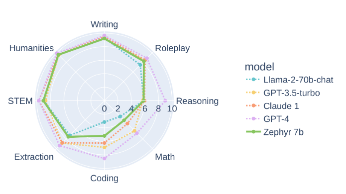

# Instruction-Tuning

Unsupervised pretraining such as Causal Language Modeling

Supervised Instruction finetuning (Multi-task finetuning)

Alignment with RLHF

### Adapting to my single task

1 - Unsupervised finetuning on a specific task (an input-output schema) of an instruction tuned LLM.

[Unsupervised finetuning BLOOM](https://colab.research.google.com/drive/1ARmlaZZaKyAg6HTi57psFLPeh0hDRcPX?usp=sharing)

2 - Instruction finetuning on a single task of an instruction tuned LLM

[instruction Tuning Falcon 7b](https://colab.research.google.com/drive/1BiQiw31DT7-cDp1-0ySXvvhzqomTdI-o?usp=sharing#scrollTo=OCFTvGW6aspE)

risks : Catastrophic forgetting

solutions : Use PEFT to finetune only a set of parameters and freeze the original ones

### Plan

-FlanT5:

FLAN fine-tunes T5 on a large set of varied instructions that use a simple and intuitive description of the task, such as “Classify this movie review as positive or negative,” or “Translate this sentence to Danish.”. The paper shows that by training a model on these instructions it not only becomes good at solving the kinds of instructions it has seen during training but becomes good at following instructions in general. It shows also that the model scale is very important for the ability of the model to benefit from instruction tuning.

FLAN-T5 model comes with many variants based on the numbers of parameters:

- FLAN-T5 small (60M)
- FLAN-T5 base (250M)
- FLAN-T5 large (780M)
- FLAN-T5 XL (3B)
- FLAN-T5 XXL (11B)

- [Full Finetuning of base Flan T5](https://www.philschmid.de/fine-tune-flan-t5) : In this experiment we do full finetuning of an instruction tuned model (FLAN) without leveraging efficient techniques. The finetuning is a one single task (dialogue summarization) instruction tuning. To reproduce the same experiment I had to use the Trainer on a T4 free colab but with a gradient_checkpointing and a combination of train_batch_size=32, fp16 mixed precision (I didn't finish the training, but it is said that fp16 leads to overflow issues with T5). It took 4 hours of training duration for the T5 base model (which is 250M parameters large). I tried to run the same experiment on a colab pro with NVIDIA V100 but it didn't work. I suppose that the memory of the p3.2xlarge AWS EC2 Instance use in the tutorial is a little bit larger. [Colab notebook](https://colab.research.google.com/drive/1_RZgtC-_cZUCrInpsLQwmZrIY-ijvNFR?usp=sharing)
- [Full Finetuning of XL/XXL Flan T5 with deepspeed](https://www.philschmid.de/fine-tune-flan-t5-deepspeed) : In this experiment we do full finetuning of an instruction tuned model (FLAN) without leveraging efficient techniques. The finetuning is a one single task (news articles summarization) instruction tuning. The XXL FLAN T5 is an 11B model. there is no way to fully finetune the model in colab. the tutorial uses deepspeed on large EC2 instances with multiple GPUs.
It starts with the preprocessing outside of the GPU instance then loading the tokenized dataset from disk and the deepspeed config file in the train script like this :

Actually different experiments were conducted in this tutorial using different config deepspeed files:

As fp16 can overflow, bf16 is the better choice because it provides significant advantages over fp32. We see also that it is better to keep a small batch size and not do offloading than the other way around. [Colab notebook](https://colab.research.google.com/drive/1Kl2ojG83-cWTip9-_hj_2mH7rTTBj5Pj?usp=sharing)
- [Finetune XXL Flan T5 with Lora and 8bit quant](https://www.philschmid.de/fine-tune-flan-t5-peft) : In this tutorial, the 11B FLAN-T5 XXL was finetuned using Lora and 8bit quantization(bnb) from Peft.
The same techniques were used for data preprocessing. The finetuning is a one single task (dialogue summarization) instruction tuning.
The only differences was the construction of the peft model and the preparing for int8 training:

This configuration uses only 0.16% of the parameters of the model. The training took 10h and cost ~13.22$. A full fine-tuning on FLAN-T5-XXL with the same duration (10h) requires 8x A100 40GBs and costs ~322$.
During evaluation, the results were slightly better than a full finetuning of FLAN-T5 base. [Colab notebook](https://colab.research.google.com/drive/1S5L1HvYv61oVKH9aZZ26nJXNt4akivN7?usp=sharing)

Another notebook was created for comparing full fine-tuning and Peft lora fine-tuning on the base FLAN-T5. [Colab notebook](https://colab.research.google.com/drive/18EzRa2oSfjOQBYz1SnCnmjLMn-X4S01h?usp=sharing)

-Bloom:

Training a 176 Billion parameter model needed the following hardware/software : 

- [Finetune 7B BLOOMZ with lora](https://www.philschmid.de/bloom-sagemaker-peft) : BLOOMZ 7b1 is the finetuned version from the pretrained [bloom 7b1](https://huggingface.co/bigscience/bloom-7b1). there is also a finetuned version for prompting in non english (ex: French) [bloomz-7b1-mt](https://huggingface.co/bigscience/bloomz-7b1-mt) a 7B parameters model, and a bigger one [bloomz-mt](https://huggingface.co/bigscience/bloomz-mt) of 176B parameters. The mt versions are finetuned on xP3mt, a Mixture of 13 training tasks in 46 languages with prompts in 20 languages (machine-translated from English).

  In this tutorial, the 7B BLOOMZ was finetuned using Lora and 8bit quantization(bnb) from Peft. The finetuning is a one single task (dialogue summarization) instruction tuning.

-LLAMA2:

- Checkout [Ressources about LLama2](https://www.philschmid.de/llama-2)

LLaMA 2 is a large language model developed by Meta and is the successor to LLaMA 1. LLaMA 2 pretrained models are trained on 2 trillion tokens, and have double the context length than LLaMA 1. Its fine-tuned models have been trained on over 1 million human annotations.

Llama 2 outperforms other open source language models on many external benchmarks, including reasoning, coding, proficiency, and knowledge tests.

However, the most exciting part of this release is the fine-tuned models (Llama 2-Chat), which have been optimized for dialogue applications using Reinforcement Learning from Human Feedback (RLHF).

- [Instruction tuning LLama2 with trl and SFTTrainer](https://www.philschmid.de/instruction-tune-llama-2)
  In this blog, it was used trl and SFTTrainer with Qlora to fine-tune Llama 7b version (not the chat version). To do so, bitsandbytes was used with some special Llama configurations to load the model in 4bit:
  
  The lora adapters were prepared as usual:
  
  Finally, the trainer is prepared with trl:
  

  Note that this way, we did not have to do the tokenization (with the truncation & padding) nor preparing the data collators beforehand. The SFTTrainer from trl took care of that. Checkout this [Colab notebook](https://colab.research.google.com/drive/1KgC3TUBIDBf-tsuLYKiAnUdE2-mOLzZg)
   
- [Finetune LLAMA2 using Qlora](https://www.philschmid.de/sagemaker-llama2-qlora)
  In this blog, LLaMA2 was instruction-tuned (on multi task instructions using dolly 15k dataset) using Qlora to fit training into a T4 tier colab. Comparing this experiment to the previous one, additional preprocessing was conducted to pack multiple samples to one sequence of 2048 length to have a more efficient training so that we passed from 15K samples (to train on in the previous experiment) to 1591 sequence to train on.

  As we did this additional preprocessing, we had to tokenize our input sequences and as result to use the simple Trainer and not the TRL SFTtrainer.

  Finally when comparing the two experiments (using 4 accumulation steps and a train batch size of 2) on a T4 free colab GPU: the first experiment would take 330h and the second would take 32h. If I choose a batch size larger than 2 I get CUDA out of memory. Checkout this [Colab notebook](https://colab.research.google.com/drive/1OOtPNwJLa3upPqGFkzJYxauo0YTSWtZ4)
    
- [Deploying LLama2 on Sagemaker](https://www.philschmid.de/sagemaker-llama-llm)

-Falcon:

Falcon is a new family of state-of-the-art language models created by the Technology Innovation Institute, it comes in 3 versions : Falcon-40B, its little brother Falcon-7B and Falcon-180B introduced later. TII has also made available instruct versions of the models, Falcon-7B-Instruct, Falcon-40B-Instruct and Falcon-180B-chat.

Falcon-7B and Falcon-40B have been trained on 1.5 trillion and 1 trillion tokens respectively. one particularity, is their training data, predominantly based (>80%) on RefinedWeb (data based on CommonCrawl but with better quality, leveraging large-scale deduplication and strict filtering to match the quality of other corpora.). Another interesting feature of the Falcon models is their use of multiquery attention. The vanilla multihead attention scheme has one query, key, and value per head; multiquery instead shares one key and value across all heads.

The models were trained and evaluated using the bfloat16, so it is better to use the same datatype. This requires a recent version of CUDA and works best on modern cards. 

For inference, you need to allow remote code execution. you would prefer bfloat 16 and for the specificity of 40B model, you can load the model in 8-bit to run in about about 45 GB of RAM (but will use torch.float16 instead of torch.bfloat16) or load it in 4bit which would take 27GB of GPU.

Checkout this [blog](https://huggingface.co/blog/falcon) from HF.

- [Finetune Falcon with QLora](https://www.philschmid.de/sagemaker-falcon-qlora)
  I tried to follow this blog and instruct-tune (Multi task instructions using the Dolly15K dataset) a pretrained Falcon-7B model on T4 GPU free colab, although in the blog we finetune the 40B model on SagemMaker.

  Basically the blog uses the same data, preprocessing steps, and same parameters for the Lora adapters and the model, so we preprocess, tokenize and pack multiple samples to sequences of 2048 length. Using the Falcon tokenizer we get 1300 sample instead of 1500 sample with the LLaMA tokenizer on the same data.

  We use the simple Trainer for training (not SFTTrainer), we launch training but we hit Cuda out of memory, I think because I am using more parameters for Falcon (Falcon has 200M additional parameters than LLaMA for the 7B versions). Actually for this experiment I used a function copied from https://github.com/artidoro/qlora/blob/main/qlora.py to identify the layers for which we would create adapters. Creating adapters for those layers with 64 rank I am almost training 2% of the model parameters. so I tried to reduce the rank from 64 to 32 and 16 and tried to reduce the number of layers to which create adapters but still hit out of memory even with 0.1% lora parameters. So I conclude that it is due to my batch sizes, I reduced the sequence length from 2048 to 512 and fortunately the training of the 7B Falcon worked on the T4 GPU colab with about 2% of lora parameters. Checkout this [Colab notebook](https://colab.research.google.com/drive/18ZCxs73eIzOqxVzoJvKMtlTif1apS6fW#scrollTo=WFI_msO_J5X-)
  
- [Finetune Falcon using Qlora with Flash Attention](https://www.philschmid.de/sagemaker-falcon-180b-qlora)
- [Finetune Falcon with deepspeed and Lora](https://www.philschmid.de/deepspeed-lora-flash-attention)

-Mistral:

Mistral-7b has been recently released (in the end of Sep)and is known as one of the best open source LLM as of today. it is the most powerful language model for its size (Which I think is very clever from the Mistral team as 7B is the accessible size for the large community to run on proprietary GPUs. This would make Mistral7B as popular as LLaMA2.)

Mistral 7B uses Grouped-query attention (GQA) for faster inference and Sliding Window Attention (SWA) to handle longer sequences at smaller cost. 

It outperforms LLaMA2 13B on all benchmarks and it claims to performs equivalently to a Llama 2 that would be more than 3x its size. checkout this [blog](https://mistral.ai/news/announcing-mistral-7b/) from the Mistral team.

Checkout this [colab](https://colab.research.google.com/drive/1dOwRPsdLYi_dMxO2TrktLvMlW0k2QBh0?authuser=0#scrollTo=rkGci_u6psuE) notebook, I used to finetune the mistral 7B model on the Guanaco dataset. I had to use the T4 GPU with augmented CPU memory from colab pro to download the model because at  loading time, CPU RAM is insufficient, and out-of-memory errors occur. Otherwise you can download a sharded model using the free T4 GPU. there is this sharded model by Youness in "ybelkada/Mistral-7B-v0.1-bf16-sharded"

Zephyr is a series of language models that are trained to act as helpful assistants, finetuned on top of Mistral 7B:
- Zephyr 7B Alpha is the first model in the series, fine-tuned on a variant of the UltraChat dataset, which contains a diverse range of synthetic dialogues generated by ChatGPT, then aligned using DPOTrainer on UltraFeedback dataset (64k prompts and model completions that are ranked by GPT-4)
- Zephyr 7B Beta is the second model in the series. On several categories of MT-Bench, Zephyr-7B-β has strong performance compared to larger open models like Llama2-Chat-70B. However, on more complex tasks like coding and mathematics, Zephyr-7B-β lags behind proprietary models and more research is needed to close the gap:

-LLAMA3.2:

Two families were released, the multimodal family and the multilingual one.

The Llama 3.2-Vision collection of multimodal large language models (LLMs) is a collection of pretrained and instruction-tuned image reasoning generative models in 11B and 90B sizes (text + images in / text out).

Model Architecture: Llama 3.2-Vision is built on top of Llama 3.1 text-only model. To the best of our understanding, the text models were frozen during the training of the vision models to preserve text-only performance. To support image recognition tasks, the Llama 3.2-Vision model uses a separately trained vision adapter that integrates with the pre-trained Llama 3.1 language model. The adapter consists of a series of cross-attention layers that feed image encoder representations into the core LLM. Note for image+text applications, English is the only language supported. Vision models have a context length of 128k tokens, which allows for multiple-turn conversations that may contain images. However, the model works best when attending to a single image, so the transformers implementation only attends to the last image provided in the input. This preserves quality and saves memory.

For finetuning the vision models, checkout this notebooks:
- using [HF Trainer](https://github.com/huggingface/huggingface-llama-recipes/blob/main/Llama-Vision%20FT.ipynb)
- Using [TRL](https://github.com/huggingface/trl/blob/main/examples/scripts/sft_vlm.py)

-QWEN2.5:

Qwen2.5, in addition to continuing to open source the four models of 0.5/1.5/7/72B of the same size as Qwen2, also added two medium-sized cost-effective models of Qwen2.5-14B and Qwen2.5-32B and a mobile-side model called Qwen2.5-3B. Qwen2.5 has acquired significantly more knowledge.

The Qwen2.5-72B base model significantly outperforms its peers in the same category across a wide range of tasks. It achieves results comparable to Llama-3-405B while utilizing only one-fifth of the parameters.
The Qwen2.5-72B-Instruct model delivers exceptional performance, even surpassing the larger Llama-3.1-405B in several critical tasks. 
Compared to other models with open weights, Qwen 2.5-72B-Instruct beats LLama 3.1 405B Instruct and Mistral Large 2 Instruct (123 billion parameters) on seven of 14 benchmarks including LiveCodeBench, MATH (solving math word problems), and MMLU (answering questions on a variety of topics).
The 7B model seems very intersting. check out performances [here](https://qwenlm.github.io/blog/qwen2.5-llm/?utm_campaign=The%20Batch&utm_medium=email&_hsenc=p2ANqtz-_40JQm9RW0mlDYx0xnAmSIob4F-iptRZ7yyYr_IPSUgKSwykBsDyCZEBaoKW-YWbZ8Tf_KWy3et-_NPrnaCqh9sjEuuA&_hsmi=326292888&utm_content=326276653&utm_source=hs_email)

-Molmo:
Molmo is a family of open vision-language models developed by the Allen Institute for AI. Molmo models are trained on PixMo, a dataset of 1 million, highly-curated image-text pairs.

Molmo 72B is based on Qwen2-72B and uses OpenAI CLIP as vision backbone. Molmo-72B achieves the highest academic benchmark score and ranks second on human evaluation, just slightly behind GPT-4o.

-QWEN-VL-72B

-Compare GPTQ and bnb:
- [GPTQ and Hugging Face Optimum](https://www.philschmid.de/gptq-llama)
- [AutoGPTQ and transformers](https://huggingface.co/blog/gptq-integration)

Cheat notebooks for instruction-tuning :
- Checkout this [Colab notebook about finetuning Llama2 with SFTTrainer](https://colab.research.google.com/drive/1KgC3TUBIDBf-tsuLYKiAnUdE2-mOLzZg)
- Checkout this [more recent colab notebook about finetuning Llama2 with SFTTrainer](https://colab.research.google.com/drive/1vJ4ADFwn123UCGHKk6LiqN_Tqcjlemsn#scrollTo=Gw1cz-9-iW7x)
- I have other notebooks finetuning Mistral and Zephyr with libraires from TRL and transformers
- checkout this [Colab notebook about finetuning with Axolotl](https://colab.research.google.com/drive/1wGymSyJN8qravejmCh0AAqJ1F-pVgrD6#scrollTo=b5SpoBI5OABj)

